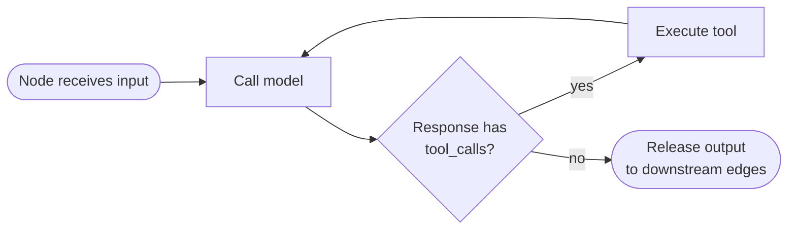

# How PR Review Crew works

This doc walks through the actual mechanics of the graph — what each node does, how data moves between them, and the two pieces of engine behavior (context propagation and the tool-call loop) that explain almost every bug we hit building this. If you want to extend the crew, this is the doc to read first.

## The graph, end to end

```mermaid
flowchart TD
    T([Task: "owner/repo#123"]) --> DF

    subgraph DF["Diff Fetcher (tool-calling)"]
        direction TB
        DF1[Parse repo/PR from task] --> DF2[Call get_pr_files]
        DF2 --> DF3[Emit REPO/PR header + diff]
    end

    DF -->|diff + REPO/PR header, full text| LS[Logic & Style Reviewer]
    DF -->|diff + REPO/PR header, full text| SEC[Security Reviewer]
    DF -->|diff + REPO/PR header, full text| DT[Docs & Tests Reviewer]

    LS -->|SECTION: Logic & Style| SYN
    SEC -->|SECTION: Security| SYN
    DT -->|SECTION: Docs & Tests| SYN

    SYN[Synthesizer] -->|one Markdown comment| CP

    subgraph CP["Comment Poster (tool-calling)"]
        direction TB
        CP1[Call post_review_comment] --> CP2[See result, echo it, stop]
    end

    CP -->|posts via REST API| GH[(GitHub)]
```

Six nodes, seven edges, all declared in [`yaml_instance/pr_review_crew.yaml`](yaml_instance/pr_review_crew.yaml). Diff Fetcher and Comment Poster are the only two that call tools; the three reviewers and the Synthesizer are pure text-in, text-out reasoning steps.

| Node | Type | Model (default) | Tools | Job |
|---|---|---|---|---|
| Diff Fetcher | agent | gpt-4o-mini, temp 0.0 | `get_pr_files` | Parses the task string, fetches the diff, emits it with a `REPO:`/`PR:` header |
| Logic & Style Reviewer | agent | gpt-4o-mini, temp 0.2 | none | Logic bugs, naming, dead code, readability |
| Security Reviewer | agent | gpt-4o-mini, temp 0.2 | none | Injection risks, secrets, unsafe patterns |
| Docs & Tests Reviewer | agent | gpt-4o-mini, temp 0.2 | none | Missing docstrings, changelog entries, test coverage |
| Synthesizer | agent | gpt-4o, temp 0.2 | none | Merges the three reports into one Markdown verdict |
| Comment Poster | agent | gpt-4o-mini, temp 0.0 | `post_review_comment` | Posts the final comment, exactly once |

## Two pieces of engine behavior that explain almost everything

### 1. Context doesn't propagate by default

ChatDev's graph only forwards a node's output to its *direct* downstream edges. Comment Poster is three hops from Diff Fetcher — without extra work, it would never see which repo or PR number it's supposed to comment on, only the Synthesizer's Markdown body.

The fix is visible in every node's `role` prompt: each one is instructed to echo the `REPO: <owner/repo>` / `PR: <number>` header forward, verbatim, at the top of its own output. It's an explicit protocol instead of relying on hidden state — you can read any single node's output in isolation and know exactly what PR it's about. The reviewer nodes also set `context_window: -1`, which tells the engine "give me the full conversation history, not just my direct input," as a second layer of safety so a node several hops downstream can still see the original task if it needs to.

### 2. Every agent node is secretly a small loop

This one isn't documented anywhere in the YAML schema — it only became visible by reading raw runtime logs. Every `agent` node gets an implicit self-loop edge. When the model's response includes `tool_calls`, the engine:

1. executes the tool(s),
2. feeds the result back into the *same* node as another turn,
3. calls the model again,
4. and repeats until a response comes back with **no** tool calls.

Only then does the node's output release to its downstream edges. This is why Diff Fetcher and Comment Poster are agent nodes with one bound tool each, rather than something simpler: the "call a tool, see the result, decide what to do next" loop is baked into every agent node's execution, whether you want it or not.

The upside: Diff Fetcher can silently retry past a transient 404 without any retry logic of my own. The downside, which we hit directly: nothing stops a model from calling a tool *again* after it already succeeded. Comment Poster's `role` prompt has to explicitly say "if you already see a success message in the conversation, do not call the tool again" — without that instruction, a model will sometimes re-invoke `post_review_comment` indefinitely, since from its perspective nothing told it to stop.



## A full request, traced

1. `python run_review.py owner/repo 123` builds the task string `"owner/repo#123"` and calls `chatdev.run_workflow`.
2. **Diff Fetcher** parses that string, calls `get_pr_files(repo, pr_number)` (defined in [`functions/function_calling/github_tools.py`](functions/function_calling/github_tools.py)), gets back a per-file diff, and emits `REPO: owner/repo\nPR: 123\n---\n<diff>`.
3. That output fans out unchanged to **all three reviewers simultaneously** — they don't wait on each other, and none of them see the other two's findings.
4. Each reviewer reads the diff, ignores everything outside its lane (the Security reviewer is explicitly told to ignore style, and so on), and emits `SECTION: <name>` plus a bulleted list.
5. **Synthesizer** has three incoming edges, so the engine waits until all three reviewers have finished before firing it. It merges the three sections into one Markdown comment with a single verdict, instructed to put each finding in exactly one section rather than duplicating it.
6. **Comment Poster** receives that Markdown, calls `post_review_comment(repo, pr_number, body)`. If `PR_REVIEW_CREW_DRY_RUN=1`, the tool returns a short preview string without hitting the network; otherwise it POSTs to GitHub's issue-comments endpoint and returns the real comment URL. Either way, the self-loop feeds that result back in, the model recognizes success and stops, and the workflow ends.

## Three bugs that map directly onto these mechanics

Worth knowing before you extend this, because the same failure modes will resurface anywhere you add a new tool-calling node:

- **Unicode in tool-call arguments is risky on small/fast models.** The Synthesizer's verdict line used to include an emoji (🟡); reproducing it inside a JSON string argument requires an exact UTF-16 surrogate pair, and `llama-3.1-8b-instant` sometimes garbled it into invalid JSON. Fix: keep tool-call payloads plain text where you can.
- **`max_tokens` has to account for the whole tool-call payload, not just the "answer."** Comment Poster's tool call embeds the entire review body as a JSON argument — if `max_tokens` only budgets for a short confirmation, the JSON gets cut off mid-string and the provider rejects it as malformed.
- **Tool results that echo their input duplicate content on the next self-loop turn.** `post_review_comment`'s dry-run branch used to return the full comment body; by the next turn, that body existed twice in context (original input + tool result), which was enough to trip a tokens-per-minute limit on a constrained free-tier model.

**A note on cost.** All of this was debugged on Groq's free tier, which made the failures cheap to iterate on — hitting a daily token cap just meant switching models or waiting, not a bill. The Comment Poster infinite-loop bug in particular burned tens of thousands of tokens across repeated retries before it was fixed, and each of the three bugs above needed several full pipeline re-runs (all six nodes, every time) to reproduce and confirm fixed. On a metered paid provider — GPT-4o/GPT-4o-mini at standard rates, say — that same debugging session would have had a real dollar cost, and an infinite-loop bug left unnoticed for longer could get expensive fast. Worth budgeting for that risk explicitly if you run this against a paid model: cap `max_attempts` conservatively, watch token usage per run, and consider a hard spend limit on the provider side while you're still shaking out a new node or prompt.

## Where to extend it

- **Add a fourth specialist** (performance, accessibility, license/dependency compliance) by adding one node plus two edges: `Diff Fetcher -> new node` and `new node -> Synthesizer`. It'll automatically run in parallel with the existing three.
- **Swap the diff source.** `get_pr_files`/`get_pr_diff` are the only GitHub-specific code in the project; a GitLab or Bitbucket equivalent with the same return shape would retarget the whole crew.
- **Add a human gate.** A `human` node between Synthesizer and Comment Poster would pause for approval before anything posts — useful if you want this running on a schedule against a real team's PRs instead of on-demand.
- **Track cost/tokens per run.** `run_workflow`'s result already includes per-node `token_usage`; logging that to a file per run would make it easy to compare model choices quantitatively instead of by feel.
- **Add real tests for `github_tools.py`.** Right now correctness was verified by mocking `requests` manually during development — a small `pytest` suite with `responses` or `requests-mock` would catch regressions before a live run does.
